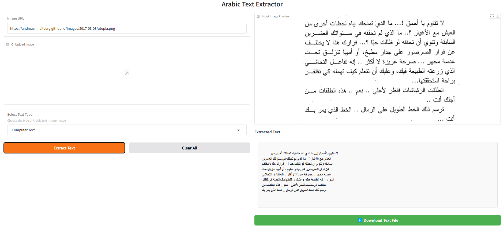
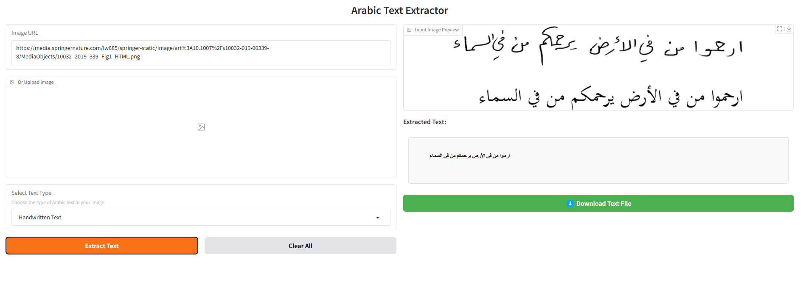

# Arabic Text Extractor

> **Fine-tuned Arabic OCR** — Built on Tesseract, optimized for handwritten Arabic text.

---

---

## 📖 About

It’s 8 PM.  
A tired teacher has spent the last 4 hours retyping 120 handwritten exam answers into a computer—one by one. Her back hurts. She keeps mixing up ط and ظ. All she can think is:  

> "**There has to be a better way.**"

She’s not alone. Across the Arab world:  
- **Teachers** lose weekends retyping exams  
- **Office workers** develop "data entry back pain" from endless form transcription  
- **Students** waste hours manually recreating handwritten notes

Then it hit us: 

What if you could simply snap a photo of Arabic text—whether neat textbook print or messy doctor handwriting—and magically turn it into editable digital text?  
No typing. No errors.

Just **click → convert → done**.

That’s how the **Arabic Text Extractor** was born—not in a fancy lab, but from real late-night struggles at a teacher’s desk.

---

## 🚀 How It Works

1. **Snap a photo** of your handwritten notes, textbook page, or exam sheet.
2. **Upload the image** to Arabic Text Extractor.
3. **In seconds**, a clean, ready-to-edit `.txt` file is generated—Arabic formatting intact, right-to-left.

✅ Works with both **printed** and **handwritten** Arabic  
✅ Supports messy handwriting  
✅ Exports text into `.txt` files for easy editing  

---

---

## 🌍 Real-World Use Cases

- Teachers digitizing **handwritten exams**  
- Students converting **class notes** into editable files  
- Businesses automating **form data entry**  
- Researchers scanning **historical Arabic manuscripts**
